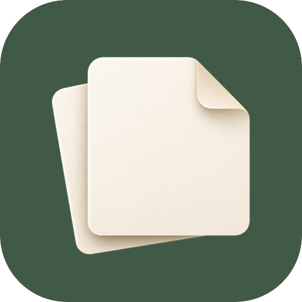

# 拾页应用外观

用户选定的方案：墨绿底色 `#405A47`、奶白色叠页与右上折角。桌面显示名为 **拾页**。



`foreground-master.png` 是经图像生成工具制作的透明前景原图；`icon-preview.png` 是与传统 Android 桌面图标相同方式合成的预览。安装包只使用各密度资源，不包含这两份文档原图。

安装 ImageMagick 7 后运行以下命令，可机械重建五档 Android 图标；脚本仅缩放、留边和合成平台图标背景，不重新绘制纸页：

```sh
bash tools/generate-shiye-icons.sh
```

普通和圆形桌面图标为 48 / 72 / 96 / 144 / 192 px。Adaptive 前景画布为 108 / 162 / 216 / 324 / 432 px，原图按 78 dp 缩放居中，给系统圆形和其他蒙版保留安全留白。通知和系统主题图标使用相同叠页轮廓的单色 vector；启动页和系统账号图标使用彩色 vector。

`AppDisplayName` 独立且不可翻译，避免被应用语言包中的 Telegram 服务名称覆盖。全部桌面别名统一显示新图标，旧图标选择行及其设置搜索入口收起；别名组件名及启用状态保留，方便已有安装直接升级。包名、签名、账号存储和协议标识沿用原配置。Telegram 服务会话头像、聊天正文及协议文案不属于应用外观资源。

Release 构建会检查 APK 中每种语言的应用显示名均为“拾页”，并继续验证原签名、包名、版本和 ABI。

后台通知的应用标题、锁定及隐藏预览时的应用名称占位也使用 `AppDisplayName`。联系人/群名、消息正文和原有隐私条件保持原逻辑。

已通过 Android Java/资源编译、16份 XML 解析和32份 PNG解码检查，图标主体位于 adaptive 安全区域。完整签名 Release 的构建记录和下载链接见[发布文档](../../android-release.zh-CN.md)。手机上的桌面缓存刷新、深浅色主题和通知外观尚需实际安装确认。
