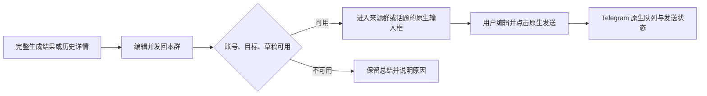

# AI 群聊总结：总结中心、界面重构与发回来源群的实施设计

本轮续做已实现命名 API 配置、实际 usage／请求耗时、用户主页官方 UID 与本群排除、选中消息快照，以及长摘要分条预览与发送。最终集成与构建状态见 [路线图本轮记录](mnn-group-summary-roadmap.zh-CN.md#本轮续做多服务用量发布与选中消息)。下方第 17 次构建作为前一轮记录保留。

本轮源码 [`ba3e70a`](https://github.com/Naza3/Telegram/commit/ba3e70a80c885b24caad54942e407930080c1aa0) 的 [第 18 次完整构建](https://github.com/Naza3/Telegram/actions/runs/37198573737) 已成功；[下载 ARM64 APK 与校验文件](https://github.com/Naza3/Telegram/actions/runs/37198573737/artifacts/11301768886)。产物 `Telegram-MNN-arm64-debug-18`，ZIP 62659786 字节，2026-10-18 19:40:48（北京时间）到期。签名沿用上一版（SHA-256 `c8715ba0c50510b9c1cc4d52b0fd2b0aed82dd55675f89c4f48d68978b7df313`），16 KB 对齐、ARM64 及原生 TL 实体回归通过。云端构建使用已有 Telegram API Secrets；真机 UI、模型性能及真实群发送未测。

上一轮源码 [`482075b`](https://github.com/Naza3/Telegram/commit/482075b91f37e90fbb8998c7357bc8a7af7ffd74) 的 [完整构建](https://github.com/Naza3/Telegram/actions/runs/37185833685) 已成功（17 分 16 秒）；[下载 APK 与校验文件](https://github.com/Naza3/Telegram/actions/runs/37185833685/artifacts/11296649826)，产物 `Telegram-MNN-arm64-debug-17`，2026-10-18 15:44:23（北京时间）到期。签名与上一轮一致（SHA-256 `c8715ba0c50510b9c1cc4d52b0fd2b0aed82dd55675f89c4f48d68978b7df313`），16 KB 对齐、ARM64 架构及云端全部回归通过。此构建没有真机息屏、MNN 性能或真实群发送的验收结论。

更新：2026-10-04（北京时间）。状态：S10–S14 首轮代码已实现，本地检查和 APK CI 已通过；不等于所有设计目标或真机验收均已完成。设计基线为 `9703bb7`，本轮未向真实群发送消息。

用户已选择第一版发送交互：**编辑确认后，发回来源群或原话题**。随后提出集中入口需求；设计建议调整为“独立 AI 总结中心作为主入口，群内保留快捷入口，两处使用同一总结页面”。沿用当前登录账号及 Telegram 原生发送身份；不引入机器人、向其他群发送的选择器或生成后自动发送。

## 0. 本轮实现清单与验证边界

下文保留完整设计目标；本节区分已经落地的代码与仍待执行的部分。

| 阶段 | 本轮代码实现 | 尚未完成的验收或设计项 |
| --- | --- | --- |
| S10 | 主列表“AI 总结”进入独立中心；“新建／历史”页签；群内快捷预填来源；来源／话题选择；按账号绑定的页面外任务控制器与进行中卡片；正文优先、详情折叠、复制 | Android Java 集成编译通过，APK CI 通过；两入口、未读语义、大字体／深色／键盘／返回均待真机；最近使用群、自动滚动暂停／回到最新内容、布局精修未全部实现 |
| S11 | 完整结果／历史详情经重读记录后转入来源群／话题的原生编辑器；保留草稿冲突检查、账号与权限复核；点击发送后预览全部分条并确认 | 真机草稿、普通群／话题、匿名身份、慢速模式和付费确认待验证；AI 发回暂不支持定时发送 |
| S12 | 稳定历史 ID；独立加密发送尝试；原生队列及服务端确认关联；已确认总结默认排除；动态长度上限内最多 64 条、Unicode 与实体边界保护、冻结预览及实际发送分条 | 本轮纯拆分及真实 TL 二进制实体回归通过；编辑器视觉、实际 ACK、断网／原消息重试仍待真机 |
| S13 | 原历史库上的本机正文／群名搜索、日期分组、群／话题筛选；“我的要求”命名保存／编辑／删除／显式选择，初始为空、账号独立加密、最多 50 条 | 搜索与选择体验、旧记录兼容和注销清理待真机；收藏及相应淘汰规则未实现 |
| S14 | 显式开始任务时启用 `dataSync` 前台服务；进度通知可返回／取消；有界 `PARTIAL_WAKE_LOCK`；任务硬上限 2 小时；系统超时会中止；进程中断标记 | Android 服务／通知／锁屏及真实 MNN 联调待验；首正文延迟、总耗时、温升、电量和参数建议均无实测，不宣称提速或持续运行必达 |

API 设置新增明确选择的服务类型：**MNN Chat 本机服务**按已知 `localapi.5` 能力限制最大输出为 `64–2048` tokens；**通用 OpenAI 兼容服务**保留 `64–8192`。旧配置不按地址、端口或模型名自动改成 MNN 类型。上下文字符预算仍为 `2048–64000`，与真实模型 token 上下文分别理解；提高 Telegram 上限不会改变服务端限制。

截至本节更新：20 个核心 JVM 测试类已通过回归；实际控制器生产类的 29 组／140 断言及前台服务生产类的 23 组／237 断言已通过 JVM 回归；Android 36／AndroidX Core 1.16 的服务 API 类型编译通过；Android 最终 Java 编译通过（1 分 2 秒，编译前后 2762 份 Java／XML 源文件一致）；完整 APK／CI 通过，真机测试待补。本轮源码、日志及 CI 结果见下，旧 APK 链接不能作为本轮验收证据。

## 1. 已有能力和优先问题

已有最近 N 条、当日、增量、未读范围，手动核心要求，筛选、分段与合并、请求输入查看、流式草稿、加密历史、聊天记录导出及本次消息追问。继续保留紧凑来源格式、不附加内置核心总结要求、新直接总结不跳回原消息。

当前最需要改善的是展示层次、可理解的状态、发送衔接及真机表现，而不是再加入一批相似入口。

| 已核实问题 | 优化决定 |
| --- | --- |
| 结果正文前有完整核心要求、输入审计、保存状态、历史入口等多行信息 | 正文前只保留群／话题、范围、条数、覆盖状态；技术详情折叠 |
| 当前结果页没有明确复制入口，历史详情已有复制 | 两处统一提供复制与长按选择；生成结果和历史共用操作组件 |
| 入口及各种动作视觉权重接近 | 每个状态只突出一个主操作，次要功能收进更多菜单 |
| 范围页仍有“摘要正文不持久化”旧文案 | 区分增量游标记录与已保存总结，修正文案 |
| 流式说明称逐步显示最终回答，实际可能是分段／合并草稿 | 清楚标记“当前分段草稿”或“合并草稿”，完成前不称最终总结 |
| 历史列表逐条展示较长摘录，缺少搜索和日期分组 | 在现有本机历史上增加查找能力，不重建历史系统 |
| MNN 输出上限依靠提示文字，填 4096／8192 仍可能到服务端才报错 | 增加明确选择的 MNN 服务配置；依据已知版本／能力提前检查，通用 OpenAI 配置保留独立范围 |
| 真实设备的首字时间、思考关闭效果、生命周期尚缺验收记录 | 沿用设备验收表测量，不用编译成功代替体验结论 |

## 2. 页面与 UI

### 总结中心作为主入口

将主聊天列表菜单中现有“AI 总结历史”升级为“AI 总结”中心入口（`DialogsActivity`），历史纳入中心的历史页签。中心仅设“新建”和“历史”两个主要页签；进行中的任务以顶部卡片展示，点卡片返回任务，不为当前最多一个活动模型任务增加空的任务列表页。

```text
AI 总结                       当前账号   设置
[ 新建 ] [ 历史 ]

正在总结：讨论群 · 分段 1/2            查看

来源群／频道   [搜索并选择             ▾]
话题          [选择话题／全群          ▾]
消息范围      [最近100条／当日／增量／未读]
核心要求      [手动填写或选择我的要求    ]

[ 开始总结 ]
最近使用的群……（后续项）
```

来源选择复用当前账号有访问权限的群／频道和话题资料，不申请通讯录权限，也不在打开中心时批量抓取各群消息。未选择来源时显示选择引导；已有生成任务时给出“查看任务”，不同时向同一个 MNN 服务提交多个推理请求。

群内“AI 总结群聊”菜单仍保留：直接打开同一总结页面并预填当前群／话题，减少用户正在读群时的操作。中心负责集中发现、管理和历史；群内入口负责带入上下文。设置、请求详情、结果页和发送逻辑都只维护一套，避免两份功能日后出现差异。

### 获取消息不依赖打开群聊

当前 `SummaryHistoryLoader` 已直接使用 `messages.getHistory` 获取普通群／频道历史，使用 `messages.getReplies` 获取具体话题；构造参数是账号、群和话题，不要求存在 `ChatActivity`。因此中心可选群后直接读取，不需要跳进聊天、模拟滚动，也无需主动标记已读。

边界在于账号是否有权读取历史，服务端不可见、已删除或未开放给该成员的内容不能由 UI 重构恢复。缓存不足时按现有分页逻辑联网，不把缓存内容当作全部历史。已知群资料／话题数据不足时先通过正常接口补齐，不能伪造 peer 或默认话题。

目前“未读”边界由进入 `ChatActivity` 前捕获；群内快捷保留“进入聊天前未读”，中心独立固定“选择范围时未读”的可靠已读边界及上界，界面标明两者语义，并防止读取行为推进已读状态。整个论坛仍需选择具体话题才能使用可靠的未读边界，不能把各话题合成一个已读游标。缺乏可靠边界时仅禁用未读并解释，最近 N 条、当日、增量仍可用。不能为了获得边界而先打开群导致未读消失。

要迁移的是页面和任务耦合：将账号变化、来源编辑／删除、访问撤销及文件交付回调从 `ChatActivity` 转发中解耦，由独立总结控制器按 scope 订阅。S10 先保证完整页面运行、返回可恢复及正确取消；S14 已接入有界前台服务和中断标记，但仍需系统／设备验收，不承诺系统或 MNN 服务永不终止。

中心切页签只解绑／重绑视图，不等同取消任务；显式停止、账号失效或来源撤销才按各自状态结束。保存线程尚未开始前取消，不保存也不推进游标；若成功结果的保存 I/O 已开始才取消，历史可能已落盘，取消令牌仍阻止推进游标及复活旧界面，不承诺原子回滚磁盘历史。导出文件的 SAF 回调也迁移到新宿主，不能依赖旧聊天页面。临时核心要求和筛选归属当前任务／来源草稿，换群时不串用；保存到本群或账号的偏好继续按已有优先级读取。原文和实际请求输入保持受限的任务内存数据，不因中心常驻而无限保留或写入历史。

### 发起总结

首屏按使用顺序排列：来源群／话题 → 范围及数量 → 手动核心要求 → 开始总结。显示当前采用“本次／本群／账号默认”的要求来源，内容为空时在输入位置提示。筛选、导出、API 设置和诊断使用次级入口。

基础连接信息和高级生成参数分组；连接状态必须标明最近测试时间，不能把过去测试成功当作当前服务在线。字符量与 token 分开：API 未返回实际 token 用量时只显示字符或明确标记估算。MNN 服务配置不能仅凭 `127.0.0.1` 推断，也不把配置名 `mnn-local` 当作已核实模型。

### 正在生成

显示当前阶段、真实分段数、已耗时、可安全显示的当前正文草稿和停止按钮。请求输入与详细计数收进“详情”。用户向上阅读后停止自动滚到底部、提供“回到最新内容”、正文刷新不抢选区及不闪屏，仍作为后续交互优化与设备验收目标，不能仅凭本轮布局重构标记完成。

明确区分“读取消息”“等待模型首个正文”“生成分段”“合并”“保存”“完成”。只有服务实际提供时才展示思考／正文 token 分项，不根据字符数编造完成比例。兼容服务把思考混在正文时继续保留过滤和兼容降级，不以直接显示全部内容解决空白。

### 结果与历史详情

```text
AI 总结                         历史  ⋯
讨论群 › 发布安排
10月4日 09:00–11:30 · 100条文字 · 已保存

这里直接展示总结正文……
栏目和语言由用户填写的核心要求决定。

查看范围和生成详情                 ▾

[ 编辑并发回本群 ]       [ 复制 ]
```

时间和条数为布局示例，不是本次真实群内容。部分覆盖、旧历史及保存失败保留简短可见标记，不能折叠到用户难以发现的位置。模型参数、完整要求、耗时细节及请求输入不占据正文首屏；历史没有原始请求输入时不能补造该数据。

支持通用段落、列表及标题排版，不只把“话题／结论／待办”三种标题加粗。先用安全的本地文本排版，不新增网页渲染或自动加载外部内容。适配 Telegram 主题、深色模式、系统大字体、屏幕阅读器和键盘；主要触控区域至少 48dp。

S10 分两步完成重构：先抽出共享结果／设置组件并修正文案，再建立独立中心及全屏总结页面，将群内入口指向同一页面。网络客户端、范围加载和历史存储尽量复用，逐项迁移生命周期，不一次重写模型协议。长文阅读、要求编辑和结果使用完整页面，短范围选择和筛选可使用底部面板。

## 3. 第一版发送流程（S11）



采用原生输入框作为发送前的编辑和确认界面，不在摘要页直接调用低层发消息 API，不新建并行发送队列。普通情况下只需点击一次“编辑并发回本群”，之后在原生输入框修改并发送；打开结果、复制、生成完成、返回页面均不会触发发送。

### 目标与身份

- 绑定真实账号 owner、来源群 ID 和话题 ID，进入页面及填入前重新核对；摘要文字里的群名、昵称或 ID 不参与路由。
- 普通群发回本群，明确话题的总结发回原话题；话题资料缺失、被删除或不可发言时停止转入，不改投其他话题。
- “论坛全部话题”没有唯一原话题，要求明确选择本群中的一个可发言话题；`topicId=0` 不等于 General 话题。
- 当前账号和原生“以谁的身份发送”规则保持可见。不能假定管理员一定以个人身份发送，也不替用户改变匿名／发送身份。
- 账号切换、退出、群迁移和权限变化均重新核对；不能把旧页面内容填到当前新群。已发送内容由 Telegram 的正常消息界面管理。

### 发什么内容

当前只填入最终总结正文。可选附加一行可编辑的标题／实际起止时间／纳入文字条数尚未实现，后续可采用例如“群聊总结｜10月4日 09:00–11:30｜100条文字”；这是客户端排版，不追加到模型输入，也不改变手动核心要求。

不自动带上提示词、API 地址、模型调试信息、请求输入、来源 ID、原文跳转或原聊天全文。不从别名／显示名猜测真实 @ 用户，不自动创建 mention-name 实体或 @全体成员；用户可以在原生编辑器中自行添加真实提及。第一版以可编辑普通文字为主，不承诺完整 Markdown 到 Telegram 富文本的无损转换。

生成原稿与用户待发送稿分离，修改发送文字不覆盖历史原总结。模型截断、取消、失败或未完成流式草稿没有成品发送入口。模型完整返回但只覆盖部分历史时，可以发出实际范围的总结，结果界面明确“部分覆盖”，不包装成完整全天总结。

### 保护现有草稿与控制长度

- 等待聊天的原生草稿恢复完成后再填入，不能裸用会直接覆盖输入的 `start_text`。
- 若已有文本、编辑中消息、待转发、语音／附件草稿或既有回复状态，首版保留原状态并阻止转入，提示先处理草稿；用户仍可返回结果页复制；不自动替换或混合两份内容。话题必需的原生回复上下文不视为用户草稿冲突。
- 转入前的发送稿留在本机；真正进入原生输入框后遵循 Telegram 的草稿规则，包括可能同步到同账号其他设备。不能把“尚未发到群”描述为“从未离开手机”。
- 按账号当前 `getMaxMessageLength()` 对原生解析后的实际待发文字拆分，不按模型 token 或固定 4096 推断，最多 64 条。超过数量、单个链接／提及／字符组合不能安全容纳时，整次拒绝并保留编辑正文。
- AI 发送先整体调用原生格式解析，再冻结规范化文字和实体；每条按同一计划预览、记录和发送，不逐条重解析／裁去空白。普通消息发送保留原路径。可跨条的加粗、代码等格式裁剪偏移；链接、提及、自定义 emoji 等不可拆实体保持完整；原生 TL 二进制复制保留访问哈希及格式字段。
- 正文、格式、目标、当前消息长度上限、付费单价、发送身份或预览设置改变，旧发送计划失效；离开页面或切换账号后，迟到的确认／付费回调不能继续发送。预览显示每条正文及数量，富文本视觉效果仍待真机验收。
- 禁言、只读、慢速模式、付费确认及发送失败规则沿用原生逻辑；不绕过、不自动确认付款。当前 AI 发回明确拒绝定时发送，不自动改为立即发送；普通聊天的原有排期功能不因此改变。

## 4. 发送记录与避免再次总结自己的总结（S12）

### 两套独立状态

生成状态：读取 → 生成 → 完成／失败／取消。发送状态：未转入 → 待编辑 → 已入队 → 服务端确认／失败。本轮已在历史同步发送尝试状态，但“已转入聊天输入框”仍不等于“已发送”，最终须有服务端确认。

“已保存历史”“已转入输入框”“消息入队”“QuickAck”都不等于“已发送”。服务端确认所有分段后才标记整份发送完成；部分成功则显示完成条数及失败条数。失败仅通过原生消息对象重试失败部分，不重新创建整份消息或自动重发成功部分。重复点击转入按钮去重；用户有意再次发送仍是独立操作。

原始总结记录保持不可变。本轮发送记录最多 100 次、8 MiB，淘汰后不再保证识别更早的已发总结。发送草稿和发送尝试采用独立、按账号加密且有容量限制的附属记录，关联 `recordId`、目标、最终发送文字及原生消息标识。不把原文或 API Key 加入其中。消息状态用局部更新写回，不能因旧回调恢复已删除的历史。缓存结果先补稳定历史 ID 绑定，不能把面板中非空的 `historyRecord` 当作当前结果已落盘的证明。

### 避免反馈循环

发送成功后，以真实账号、群和服务端消息 ID 标记“由本客户端发送的总结”。后续默认从模型输入中排除这些已确认记录，并显示排除数及可手动开启的“包含已发送总结”。不按文字标题或发言人猜测，不排除用户的其他普通发言；其他设备和客户端发出的总结不能自动认定。

范围定义保持可解释：若“最近 N 条”先选出候选消息再筛选，就明确展示“最近100条文字 → 排除2条已发送总结 → 实际输入98条”，不得悄悄向前补消息却仍显示原范围。复用既有筛选与增量完整性规则，不能因此跳过尚未处理的普通消息。只有确认成功的发送记录参与排除；本地标记不改变 Telegram 消息正文。

### 开放长总结

本轮已加入“将发送几条”的一致预览，预览和实际发送使用同一拆分结果，不分别计算。慢速模式不支持一次多条时保留原生限制。多条消息不是一个原子事务，不承诺全成或全败；失败只沿用对应原生消息重试，不重发整份摘要，也不自动退回文件发送。

## 5. 后续使用体验（S13–S14）

- 历史按日期分组，按群／话题与正文搜索；显示生成时间和覆盖范围，本轮已显示准备／发送中／已发送／失败／部分完成／中断状态。旧记录继续可读，源群不可发言只影响发送功能。收藏需同时定义容量和淘汰规则，不能悄悄取消现有存储上限。
- 用户可将自己编写的核心要求保存为带名字的“我的要求”，显式选择后填入。仍以空值为初始状态，不恢复内置核心 Prompt、不隐式增加字数／栏目规则。
- 先测短文本 10／100 条及长文本的读取耗时、首正文时间、总耗时、请求数、失败原因；使用同一手机、模型、输入和参数对照。关闭思考是否真正生效以 MNN 行为和实际返回为证据，不能只看 Telegram 开关。
- 生命周期已接入页面外任务控制器与 `SummaryForegroundService`：仅由可见界面的显式开始操作启动 `dataSync` 服务，通知只显示阶段／计数，提供返回中心和停止。复用现有 `WAKE_LOCK` 权限持有有界 `PARTIAL_WAKE_LOCK`；每任务从开始起最多 2 小时，结束／取消／失败／账号失效释放；系统 `onTimeout` 同样中止任务并释放资源。服务不自动重启推理，进程被杀后仅显示未确认完成／中断标记，不保存来源全文或自动重发请求／群消息。没有主动申请通知、通讯录或其他运行时权限；Android 13+ 未授权通知时抽屉可见性由系统决定，不能假称一定能看到通知。
- 输入预算快捷配置按服务能力和测量结果推荐，不能把 64000 字符预算当成模型真实上下文，也不以继续提高输出上限解决思考耗尽 token 的问题。

## 6. 执行顺序与验收

| 阶段 | 交付 | 验收条件 |
| --- | --- | --- |
| S10 总结中心与统一页面 | 共享组件、中心主入口、群内快捷入口、独立完整页面、正文优先、详情折叠、复制及正确文案 | 两入口同逻辑；不打开群也能读取；不推进已读；账号／来源事件正确；大字体／深色／长文／键盘可用 |
| S11 编辑后发回 | 新结果及历史详情进入来源群／原话题的原生编辑器；单条限制与草稿保护 | 仅最终点击发送才发出；无草稿覆盖、错账号、错群或错话题；原生权限规则有效 |
| S12 发送可靠性 | 服务端确认关联、原稿／发送稿、失败状态、防重复导入、排除已发送总结、长文拆分修正 | 重试不复制成功消息；生成游标不因发送变化；拆分无正文字符丢失；部分成功如实显示 |
| S13 历史及要求管理 | 搜索、日期分组、群／话题过滤、用户自建要求 | 旧历史兼容、账号隔离、搜索无联网；新要求只作用于用户选择的新任务 |
| S14 任务和性能 | 完善后台／中断恢复、实测参数建议 | 真机首字和总耗时可对照；关闭／返回／进程重启状态正确；不自动重算或自动发送 |

每阶段独立提交和验收，再进入下一阶段。S10 先交付共享组件，再交付中心与统一页面，不与 S14 的后台执行一起大改；S11 不等待高级搜索或模型性能优化。原有 S0–S9 真机欠项继续保留，遇到相关问题按原编号修复。自动化、APK 构建、真机验证分别记录；本轮代码实现状态见第 0 节，未通过的构建／设备项目继续保留。

发送验收至少覆盖：普通群、明确话题、全论坛选择目标、只读／禁言、话题删除、群迁移、账号切换；已有文字／富文本／语音／附件／编辑／转发／回复状态；超长连续中文／emoji、慢速模式、付费确认；快速连点、离线、断网、原生失败重试、进程关闭、历史删除后的晚到回调。真机发送只在专门测试群中由测试者明确点击，规划本身不授权实际发言。

## 7. 代码落点和本轮范围

| 落点 | 使用方式 |
| --- | --- |
| 新总结中心、统一总结页面及任务控制器 | 账号范围内选群和任务入口；群内菜单只负责传入来源，不复制业务实现 |
| `GroupSummarySheet.showResult()`、`SummaryHistoryDetailActivity` | 共用结果操作；来源和记录标识作为明确快照传递 |
| `ChatActivity`、`ChatActivityEnterView` | 草稿加载完成后安全填入；原生编辑、权限、发送与重试 |
| `SummaryPublishHelper`、`TopicsFragment`、`ChatActivity.setThreadMessages()` | 按来源群和明确话题进入原生编辑器；全部话题须选定目标，资料不全不降级到 General |
| `SummaryHistoryStore`、`SummaryResultCache`、`SummaryPublishStore` | 稳定记录关联、迁移兼容及独立发送状态，不把生成完成与发送成功混合 |
| `SummaryHistoryPanel`、`SavedSummaryPrompts` | 搜索／日期／范围过滤与用户命名要求；沿用原历史，不附加内置核心 Prompt |
| `SummaryTaskController`、`SummaryTaskCheckpoint`、`SummaryForegroundService` | 页面外任务、有界前台服务及中断标记；不自动恢复推理 |
| `SendMessagesHelper`、`NotificationCenter` | 复用原生消息对象及服务端确认／错误事件，避免重复队列 |
| `SummaryFilter`、`SummaryHistoryLoader` | 基于已确认 ID 排除本客户端总结，显示候选及实际输入数 |

暂缓自动发送、机器人代发、跨群推送、定时日报、图片／语音总结和跨群长期记忆。本轮正在集成代码实现和 APK 验证，不主动申请运行时权限，不发送真实群消息。
